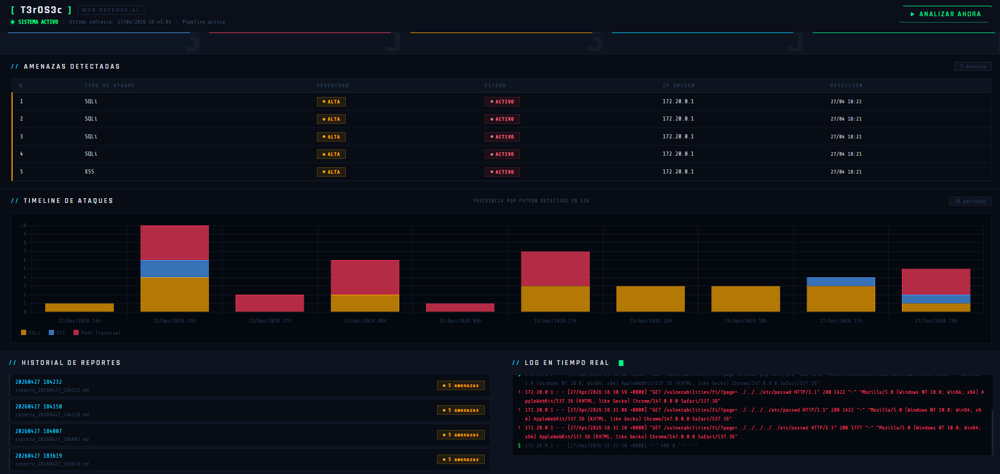
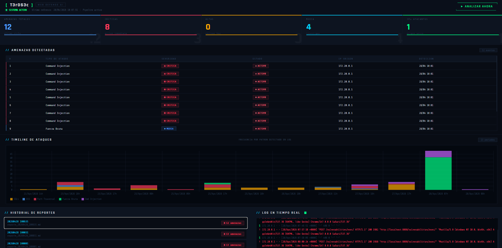
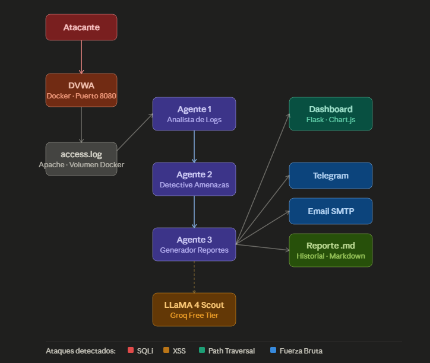
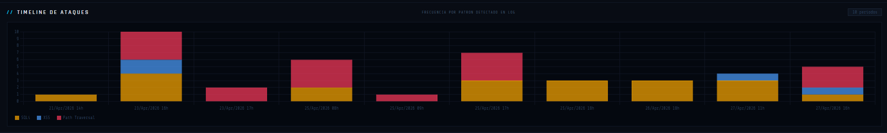
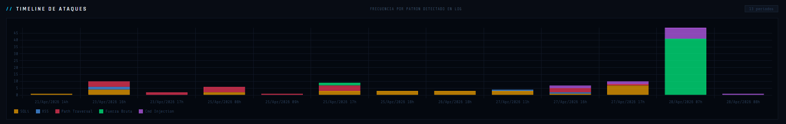
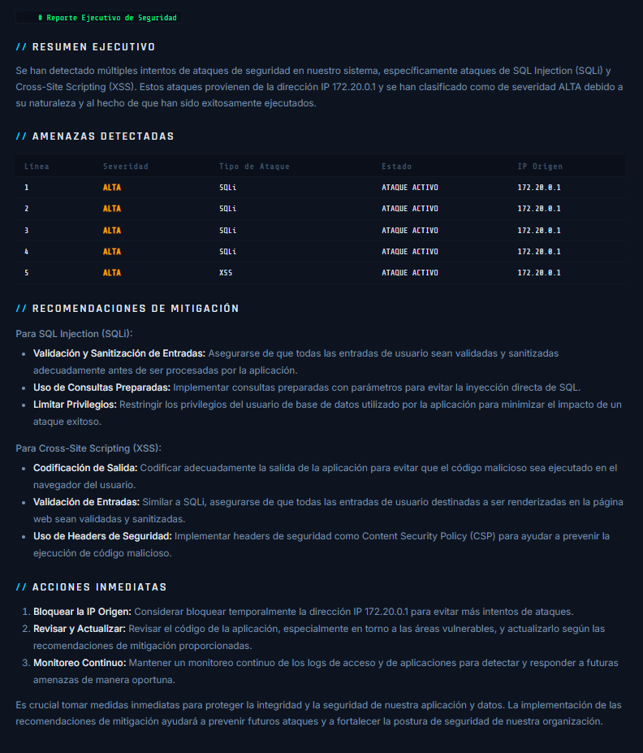
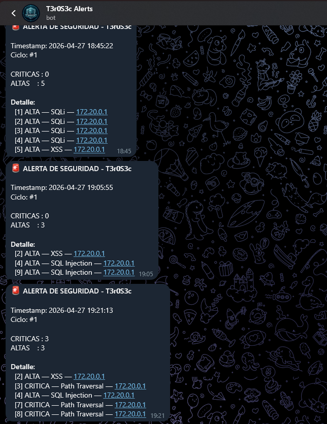
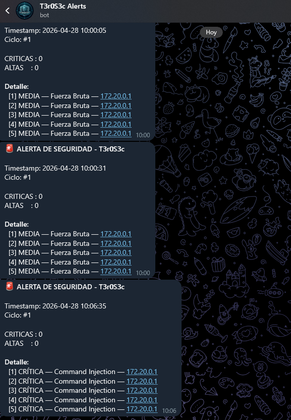

# 🛡️ Web Defense AI System — T3r0S3c

> Sistema de ciberseguridad defensiva con Agentes de IA que analiza logs de Apache en tiempo real, detecta ataques web y genera reportes ejecutivos automáticos.


---

## 🎯 ¿Qué hace este sistema?

Monitoriza en tiempo real los logs de Apache de una aplicación web vulnerable (DVWA), detecta patrones de ataque usando 3 agentes de IA especializados que trabajan en cadena, y genera reportes ejecutivos con recomendaciones de mitigación. Cuando detecta amenazas críticas, notifica automáticamente por Telegram y Email.

---

## 📸 Screenshots

### 🖥️ Dashboard Principal
> Vista general del sistema con métricas en tiempo real, tabla de amenazas clasificadas por severidad y log de actividad.





---

### 🏗️ Arquitectura del Sistema
> Flujo completo desde el atacante hasta las notificaciones, pasando por los 3 agentes de IA.



---

### 📊 Timeline de Ataques
> Distribución temporal de ataques por tipo: SQLi, XSS, Path Traversal, Fuerza Bruta y Command Injection.





---

### 📄 Reporte Ejecutivo
> Reporte generado automáticamente por el Agente 3 con tabla de amenazas, recomendaciones y acciones inmediatas.



---

### 🔔 Notificaciones en Tiempo Real
> Alertas automáticas enviadas por Telegram cuando se detectan amenazas críticas o altas.





---

## 🏗️ Arquitectura

```
Atacante → DVWA (Docker) → Apache access.log
                                    ↓
                         Volumen Docker compartido
                                    ↓
                    ┌───────────────────────────────┐
                    │     3 Agentes de IA (CrewAI)  │
                    │                               │
                    │  Agente 1: Analista de Logs   │
                    │  Agente 2: Detective Amenazas │
                    │  Agente 3: Generador Reportes │
                    └───────────────────────────────┘
                                    ↓
                    ┌───────────────────────────────┐
                    │      Dashboard Flask          │
                    │  + Notificaciones Telegram    │
                    │  + Notificaciones Email       │
                    └───────────────────────────────┘
```

---

## 🛠️ Stack Tecnológico

| Categoría | Tecnología |
|---|---|
| Agentes IA | CrewAI 1.14 |
| LLM | LLaMA 4 Scout (Groq Free Tier) |
| Backend Dashboard | Python 3.11 + Flask |
| Contenedores | Docker + DVWA |
| Visualización | Chart.js |
| Notificaciones | Telegram Bot API + SMTP Gmail |
| Detección | Apache access.log analysis |

---

## 🔍 Ataques detectados

- **SQL Injection** — OR 1=1, UNION SELECT, blind SQLi
- **Cross-Site Scripting (XSS)** — Reflejado y Almacenado
- **Path Traversal / LFI** — ../../etc/passwd
- **Fuerza Bruta** — múltiples POST al login en ventana temporal
- **Command Injection** — patrones de ejecución de comandos

---

## 🚀 Instalación rápida

### Requisitos
- Python 3.11+
- Docker Desktop
- API Key gratuita de [Groq](https://console.groq.com)

### Pasos

```bash
# 1. Clonar el repositorio
git clone https://github.com/EnriqueForte/web-defense-ai.git
cd web-defense-ai

# 2. Crear entorno virtual
python -m venv .venv
.venv\Scripts\Activate.ps1  # Windows PowerShell

# 3. Instalar dependencias
pip install -r requirements.txt

# 4. Configurar variables de entorno
cp .env.example .env
# Editar .env y añadir tu GROQ_API_KEY

# 5. Levantar contenedores Docker
docker compose up -d

# 6. Arrancar el dashboard
python dashboard\app.py
```

Abre `http://localhost:5000` en tu navegador.

---

## ⚙️ Configuración

Copia `.env.example` a `.env` y rellena los valores:

```env
# LLM
GROQ_API_KEY=tu_api_key_aqui
LLM_MODEL=groq/meta-llama/llama-4-scout-17b-16e-instruct

# Rutas
LOG_PATH=./logs/access.log
REPORT_PATH=./reports/

# Pipeline
INTERVALO_MINUTOS=2

# Telegram (opcional)
TELEGRAM_BOT_TOKEN=
TELEGRAM_CHAT_ID=

# Email (opcional)
EMAIL_REMITENTE=
EMAIL_PASSWORD=
EMAIL_DESTINATARIO=
EMAIL_SMTP_SERVER=smtp.gmail.com
EMAIL_SMTP_PORT=587
```

---

## 📁 Estructura del proyecto

```
web-defense-ai/
├── agents/
│   ├── log_analyst.py        # Lector y pre-filtrado del access.log
│   ├── threat_detector.py    # Agente 2: clasificación de amenazas
│   └── report_generator.py   # Agente 3: generación de reportes
├── config/
│   ├── settings.py           # Configuración global
│   ├── prompts.py            # Prompts del sistema para cada agente
│   └── notifications.py      # Telegram + Email
├── dashboard/
│   ├── app.py                # Servidor Flask
│   ├── templates/
│   │   ├── index.html        # Dashboard principal
│   │   └── report.html       # Vista de reporte individual
│   └── static/
│       ├── style.css         # Tema dark cybersecurity
│       └── favicon.svg
├── docker/
├── logs/                     # access.log sincronizado desde Docker
├── reports/                  # Reportes generados + historial
├── main.py                   # Orquestador de agentes CrewAI
├── pipeline.py               # Pipeline automatizado
├── sync_logs.ps1             # Script sincronización Windows
└── docker-compose.yml
```

---

## 🖥️ Dashboard

El dashboard incluye:
- **Métricas en tiempo real** — total, críticas, altas, medias, IPs atacantes
- **Tabla de amenazas** — con severidad, tipo, estado, IP origen y timestamp
- **Timeline de ataques** — gráfico de barras apiladas por hora y tipo
- **Log en tiempo real** — actualización automática cada 15 segundos
- **Historial de reportes** — acceso a reportes anteriores en formato Markdown renderizado
- **Notificaciones automáticas** — Telegram y Email al detectar amenazas críticas

---

## 📋 Uso del pipeline automatizado

```powershell
# Sincronizar log y ejecutar análisis manual
.\sync_logs.ps1
python main.py

# Pipeline continuo (análisis cada 2 minutos)
python pipeline.py

# Dashboard web
python dashboard\app.py
```

---

## ⚠️ Aviso legal

Este proyecto está diseñado exclusivamente para **entornos de laboratorio y aprendizaje**. DVWA es una aplicación intencionalmente vulnerable. Nunca expongas este sistema en redes públicas ni lo uses contra sistemas sin autorización expresa.

---

## 👤 Autor

**T3r0S3c** — Proyecto de portfolio en Ciberseguridad

[](https://linkedin.com/in/enriqueforte)
[](https://github.com/EnriqueForte)